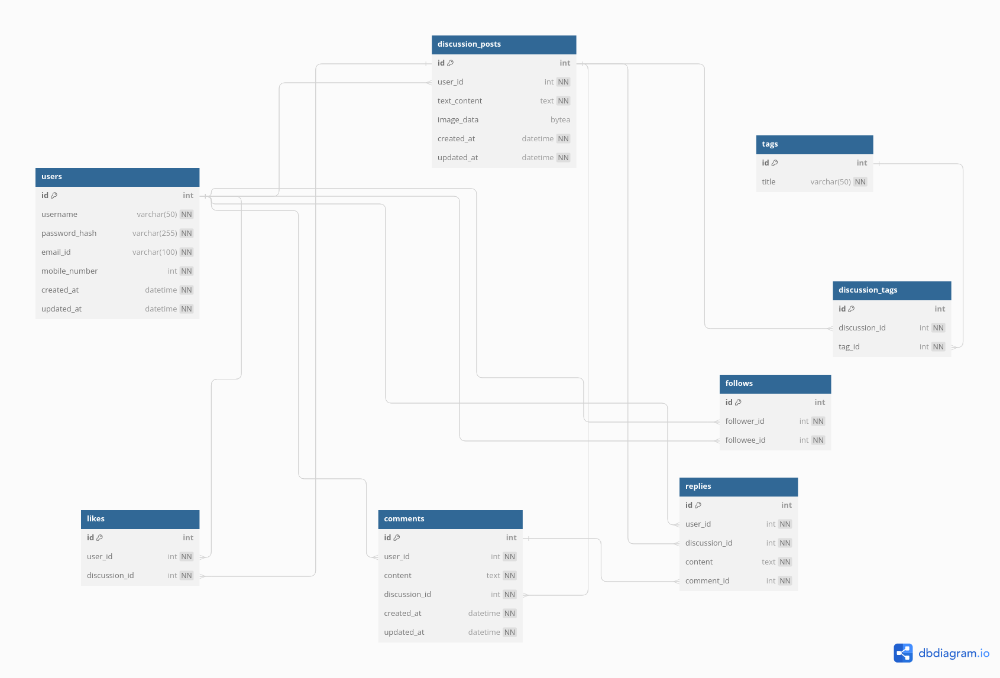

# thread / "Study Projekt"
## Problem we're trying to solve

We all know that AI is very effective at tasks like summarizing content, categorizing posts, and automatically tagging information. In general, it performs especially well when given a large corpus of data, where it can intelligently cluster similar items together—often more effectively than traditional methods like K-means.

Now, consider the situation for students who arrive in Cottbus. They typically join multiple WhatsApp groups, Discord channels, and Telegram groups to find accommodation, access study materials, or understand systems like the BTU portal. However, these platforms quickly become overwhelming due to the high volume of messages.

For example, if someone shares important information such as “guidelines for submitting an internship report,” that message can easily get lost among hundreds of other messages. As a result, valuable information becomes difficult to retrieve later.

This is where AI-based clustering can provide a solution. By automatically grouping related messages into meaningful categories, summarizing key information, and removing duplicate posts, the system can reduce noise, minimize spam, and make important content easily accessible.

## Running Locally

To launch the service locally, execute the following commands:

```bash
# Remove old containers and volumes
docker-compose down -v --remove-orphans
docker-compose -f docker-compose-offline.yml down -v --remove-orphans

# Build the services
docker-compose -f docker-compose-offline.yml build

# Start the services
docker-compose -f docker-compose-offline.yml up
```

## Architecture

The service leverages a clean separation of concerns across its core components: authentication, discussion management, and social interactions. The high-level domain and database model is illustrated below:




# work